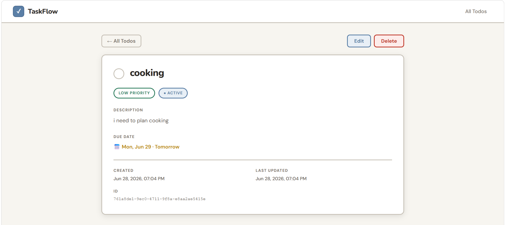
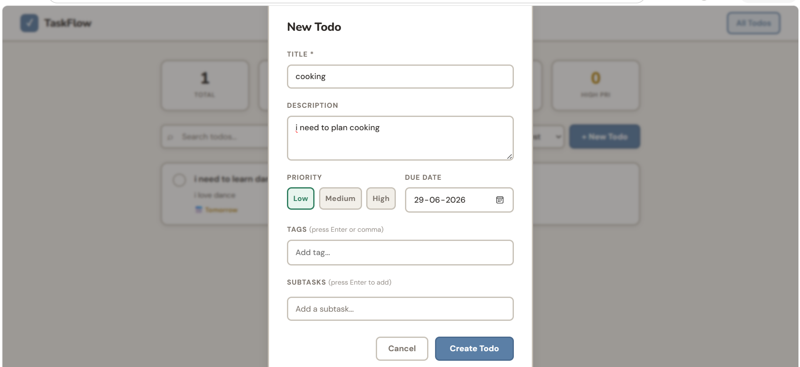

# TaskFlow — Todo Application

A full-stack, multi-page todo application with a React frontend and a Node.js/Express REST API backend.

---

## ✅ Brief Compliance

| Requirement | Status |
|---|---|
| Multi-page React app (not SPA) | ✔️ Two routed pages — see [Pages](#pages) |
| Page 1: Todo list with features | ✔️ Stats, filtering, sorting, create, delete — see [Features](#features) |
| Page 2: Single todo via query param | ✔️ `/todo?id=<uuid>` — see [Pages](#pages) |
| Node.js + Express backend | ✔️ `backend/server.js` |
| CRUD APIs for todos | ✔️ GET / POST / PUT / PATCH / DELETE — see [API Reference](docs/api.md) |
| Data persisted (file or DB) | ✔️ Flat-file JSON store — `backend/todos.json` |
| Features documented in `.md` files in repo | ✔️ [docs/features.md](docs/features.md) · [docs/api.md](docs/api.md) |

---

## Stack

| Layer | Technology |
|---|---|
| Frontend | React 18, React Router v6, Vite, CSS Modules |
| Backend | Node.js, Express.js |
| Persistence | JSON file (`todos.json`) |

---

## Screenshots

### Main Page

### Adding To-Do

### To-Do detail

### Search To-Do

---

## Features

### 📋 Todo List
- Live stats dashboard — Total, Active, Done, Overdue, and High Priority counts
- Create todos with title, description, priority, due date, tags, and subtasks
- Color-coded priority indicator on every row (red = High, amber = Medium, green = Low)
- Due date badges that flag **Overdue** (red) and **Today/Tomorrow** (amber) automatically
- Subtask progress shown inline (e.g. `2/5`)
- Filter by status (All/Active/Completed), priority, and free-text search — combinable
- Sort by Newest, Priority, or Due Date
- Delete with confirmation, hover-to-reveal on the list

### 📝 Todo Detail 
- Full view with priority badge, status badge, description, tags, and metadata (created/updated timestamps, UUID)
- Toggle the whole todo or individual subtasks, with a live progress bar
- Edit in-place via a pre-filled form
- Clear error state for invalid or missing `?id=`

### 🎨 Design
- Clean, light UI with a warm paper background and ink-blue accent
- Color-coded priority "tabs" on each task card
- Responsive at all viewport widths

Full feature breakdown: [docs/features.md](docs/features.md)

---

## API Reference

| Method | Endpoint | Description |
|---|---|---|
| `GET` | `/todos` | List todos (filter by `status`, `priority`, `tag`, `q`) |
| `GET` | `/todos/:id` | Get a single todo |
| `POST` | `/todos` | Create a todo |
| `PUT` | `/todos/:id` | Update a todo |
| `PATCH` | `/todos/:id/toggle` | Toggle todo completion |
| `PATCH` | `/todos/:id/subtasks/:subtaskId/toggle` | Toggle a subtask |
| `DELETE` | `/todos/:id` | Delete a todo |
| `GET` | `/stats` | Aggregate counts (total/active/completed/high/overdue) |

Full request/response shapes: [docs/api.md](docs/api.md)

---

