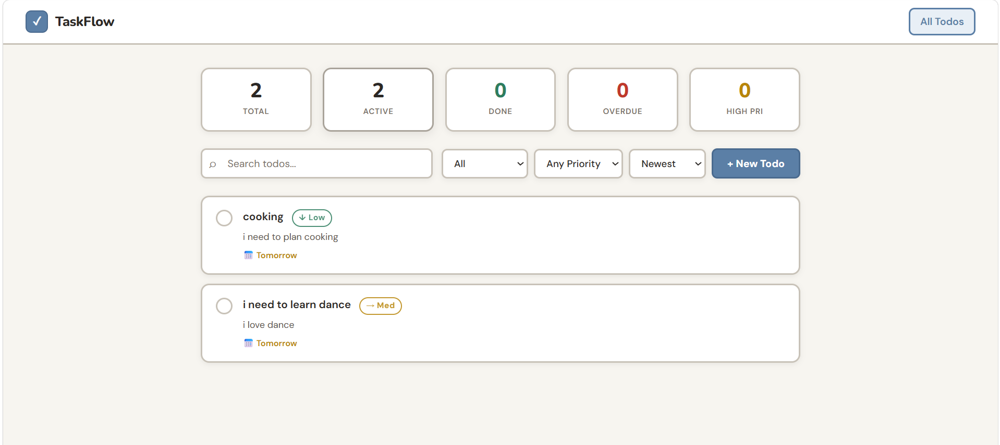
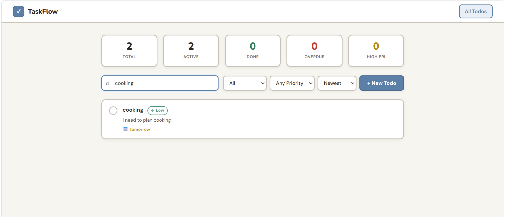

# TaskFlow — Todo Application

A full-stack, multi-page todo application with a React frontend and a Node.js/Express REST API backend.

---


| Requirement | Status |
|---|---|
| Multi-page React app (not SPA) | ✔️ Two routed pages  |
| Page 1: Todo list with features | ✔️ Stats, filtering, sorting, create, delete  |
| Page 2: Single todo via query param | ✔️ `/todo?id=<uuid>`  |
| Node.js + Express backend | ✔️ `backend/server.js` |
| CRUD APIs for todos | ✔️ GET / POST / PUT / PATCH / DELETE  |
| Data persisted (file or DB) | ✔️ Flat-file JSON store  |


---

## Stack

| Layer | Technology |
|---|---|
| Frontend | React 18, React Router v6, Vite, CSS Modules |
| Backend | Node.js, Express.js |
| Persistence | JSON file (`todos.json`) |

---

## Screenshots

### Main Page — Todo List


### Adding a To-Do


### To-Do Detail


### Search & Filter


---
# Features & Functionality

## Page 1 — Todo List (DASHBOARD)

### Stats Dashboard
Five live counters at the top of the page update after every action:
- **Total** — total number of todos
- **Active** — todos not yet completed
- **Done** — completed todos
- **Overdue** — active todos whose due date is in the past
- **High Pri** — todos with high priority

### Create Todo
Click **+ New Todo** to open a modal form with:
- **Title** (required)
- **Description** — optional free-text notes
- **Priority** — Low / Medium / High, selected via button group
- **Due Date** — date picker
- **Tags** — type a tag and press Enter or comma to add; multiple tags allowed
- **Subtasks** — press Enter after each subtask title to add it to the list

### Todo List Item
Each row shows:
- **Checkbox** — click to toggle completion; checked items display with strikethrough and reduced opacity
- **Title**
- **Priority indicator** — color-coded label (red = High, amber = Medium, green = Low)
- **Description preview** — truncated to one line
- **Due date badge** — shows "Overdue" in red, "Today"/"Tomorrow" in amber, or the short date
- **Subtask progress** — e.g. `☐ 2/5` when the todo has subtasks
- **Tags** — pill badges
- **Delete button** — appears on hover, asks for confirmation before deleting
- Clicking the row navigates to the detail page for that todo

### Filtering
Three independent filter dropdowns:
| Filter | Options |
|---|---|
| Status | All / Active / Completed |
| Priority | Any Priority / High / Medium / Low |
| Search | Free-text search across title and description |

Filters can be combined (e.g. Active + High priority).

### Sorting
A sort dropdown with three modes:
- **Newest** — most recently created first (default)
- **Priority** — High → Medium → Low
- **Due Date** — earliest due date first; todos without a due date appear last

---

## Page 2 — Todo Detail 

Accessed by clicking any todo row, or directly via URL with a `?id=` query parameter.

### What is displayed
- Title (with strikethrough if completed)
- Priority badge (color-coded, all-caps, monospace)
- Status badge (ACTIVE or COMPLETED)
- Description (if present)
- Due date with human-readable context (Overdue / Due today / Tomorrow / short date)
- Tags as pill badges
- Subtask list with individual checkboxes and a progress bar
- Metadata section: created-at, last-updated, and the UUID of the todo

### Actions
- **Toggle completion** — checkbox in the title row toggles the whole todo
- **Toggle subtask** — click any subtask row to mark it done/undone; the progress bar updates instantly
- **Edit** — opens the same form (pre-filled) used for creation; saves via PUT
- **Delete** — deletes the todo and redirects back to the list
- **← All Todos** — back link to the list page

### Error state
If the URL contains an invalid or missing `?id=` parameter, the page shows a clear error message and a back button.

---

## Data Model

```json
{
  "id": "uuid-v4",
  "title": "string (required)",
  "description": "string",
  "priority": "low | medium | high",
  "dueDate": "YYYY-MM-DD | null",
  "tags": ["string"],
  "subtasks": [
    { "id": "uuid-v4", "title": "string", "completed": false }
  ],
  "completed": false,
  "createdAt": "ISO 8601",
  "updatedAt": "ISO 8601"
}
```

---

## UX Details

- Dark-themed design, works at all viewport widths
- Delete on the list requires hover; delete on the detail page requires a browser confirmation dialog
- The modal form closes when clicking the backdrop
- Priority buttons highlight in the priority's own color (red/amber/green)
- Tags and subtasks in the form are added via keyboard (Enter / comma) to keep hands on the keyboard
## API Reference

| Method | Endpoint | Description |
|---|---|---|
| `GET` | `/todos` | List todos (filter by `status`, `priority`, `tag`, `q`) |
| `GET` | `/todos/:id` | Get a single todo |
| `POST` | `/todos` | Create a todo |
| `PUT` | `/todos/:id` | Update a todo |
| `PATCH` | `/todos/:id/toggle` | Toggle todo completion |
| `PATCH` | `/todos/:id/subtasks/:subtaskId/toggle` | Toggle a subtask |
| `DELETE` | `/todos/:id` | Delete a todo |
| `GET` | `/stats` | Aggregate counts (total/active/completed/high/overdue) |


---
